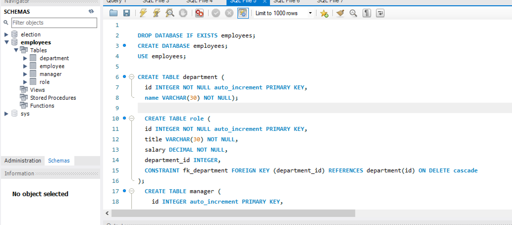
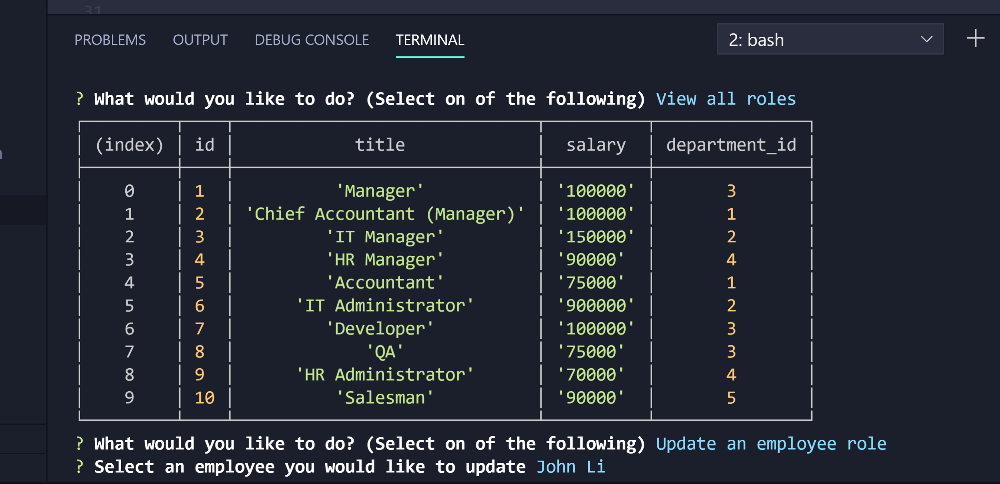

# Employee-tracker

## Description

This project will allow an employer to add and update an employee roster with an easy and simple to use CMS.

## Table of Contents

- [Installing](#installing)
- [Usage](#usage)
- [Instructions](#instructions)
- [Credits](#credits)

### Installing

1. Go to https://github.com/irina256/Employee-tracker and click on the "Clone or Download" button.
2. navigate to employee-tracker-master.
3. If you don't have the prerequisites installed, type the following:
   - npm install inquirer
   - npm install mysql2
   - npm install console-table
4. Then use your Git terminal to execute server.js.

## Usage

This app is for anyone who wants to organize their employees and departments

## Instructions

- Video instructions on how to use this app:
  https://drive.google.com/file/d/16NQAaniM2m8gZUcOv0Ijc-pHHkZlCkTH/view?usp=sharing

- Screenshot of MySQL used for creating DB and tables
  

- Screenshot of the app
  

## Credits

Created by: [irina256](https://github.com/irina256)
